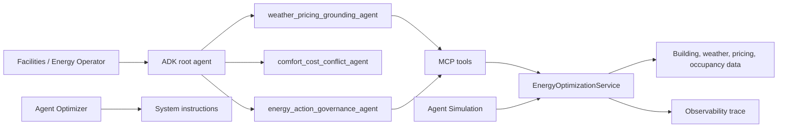

# Architecture

## Runtime Boundaries

The Gemini-backed ADK agents are responsible for conversation planning, tool
selection, agent handoff, and final explanation. Deterministic services own
safety-versus-cost conflict resolution for edge cases.

The energy service owns business rules:

- extreme weather detection
- peak pricing detection
- critical-zone safety priority
- flexible-load shedding
- portfolio demand-response allocation across multiple buildings, shedding
  lower-business-risk sites first and protecting safety-critical buildings
- cost and CO2 avoidance accounting from utility tariffs and grid marginal
  emissions
- source preservation
- observability trace generation

## Data Flow

1. A facilities operator asks for an energy plan.
2. The grounding agent retrieves weather, utility pricing, building, and
   occupancy context.
3. The conflict agent evaluates comfort versus cost.
4. The deterministic energy service resolves the conflict.
5. The governance agent recommends safe HVAC and load-shedding actions.
6. The simulator verifies rare cases and records trace steps.

## Production Upgrade Path

The JSON repository can be replaced by adapters for weather providers, utility
tariffs, building-management systems, occupancy sensors, or Vertex AI Search.

For Google Cloud:

- deploy the ADK A2A app to Agent Engine Runtime or Cloud Run
- move durable state to Firestore or Cloud SQL
- export structured logs to Cloud Logging
- trace MCP tool latency with Cloud Trace
- store secrets in Secret Manager
